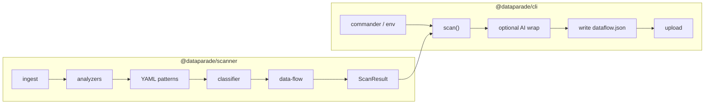

# Extract the scanner from the CLI

Initiative: `KDATAP-4f6956`. One board. New issues use `KDATAP` keys.

## Split

- New repo: `DataParade-io/scanner` (not the `dataparade` monorepo)
- Package: `@dataparade/scanner`
- Public API: `createDefaultScanConfiguration`, `scan(config) -> ScanResult`

The scanner owns finding the map and scoring it.
The CLI owns running that, writing `dataflow.json`, and uploading.

endymion is admin on DataParade-io and can create the repo.

## Code cut

`scan-pipeline.ts` today imports AI enrichment and LangSmith. Split that first (`KDATAP-439908`) or the library drags the CLI with it.

Detection config that the engine needs (actor / property / third-party) moves with the scanner (`KDATAP-838c13`). CLI env, upload, redact, resolve stay.

## First cut (moves)

- `src/ingest`, `src/analyzers`, `patterns/` YAML, `src/classifier`, `src/data-flow`, `src/pii-signals`
- `src/core` structural pipeline, graph mapping, schema, types
- engine detection config
- unit tests: analyzers, classifier, data-flow, ingest, patterns, pii-signals, pipeline, core, eval
- `tests/eval`, `tests/benchmark`
- `features/scan-findings.feature`, `features/scanner-recall-evaluation.feature`

## Stays in the CLI

- commander, CLI env, write `dataflow.json`
- upload, quota, telemetry, Sentry
- AI enrichment and LangSmith (call after `scan()`)
- unit tests: cli, upload, platform-api, observability, tracing, ai-enrichment

## Build order

1. Split deterministic `scan()` from the AI wrap in this repo
2. Create `DataParade-io/scanner`
3. Move the engine, tests, and specs
4. CLI depends on `@dataparade/scanner` and deletes the in-tree copy
5. Four-layer eval (`KDATAP-0dbc61`) is added in the scanner project

## Epics

- `KDATAP-6dbc6b` package boundary
- `KDATAP-1d77fb` stand up the scanner project
- `KDATAP-3ee2c2` move eval, corpus, and behavior specs
- `KDATAP-c5e46d` CLI becomes a consumer
